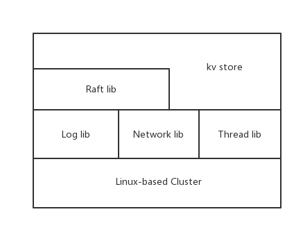

## SapphireDB [](https://travis-ci.org/cdcupt/sapphiredb)

----------
A distributed metafile system
## Getting Started
### Download
```
git clone https://github.com/cdcupt/sapphiredb.git
```
### Install
```
mkdir build
cd build
cmake ..
make
```
### Introduction
SapphireDB is a distributed storage engine. Why is it called sapphire, because sapphire is a symbol of nobility. I also hope that this system will be as unique as sapphire.
This system consists of several parts, namely the log library, the thread library, the network library, the consistency library, and the underlying kv engine. The consistency library and the kv engine belong to the top-level dependencies, and the kv engine also depends on the consistency library to provide highly reliable services. Here is a brief description of the structure, others will be described in detail in the wiki.
### Structure

### Documents
[Wikis](https://github.com/cdcupt/sapphiredb/wiki)